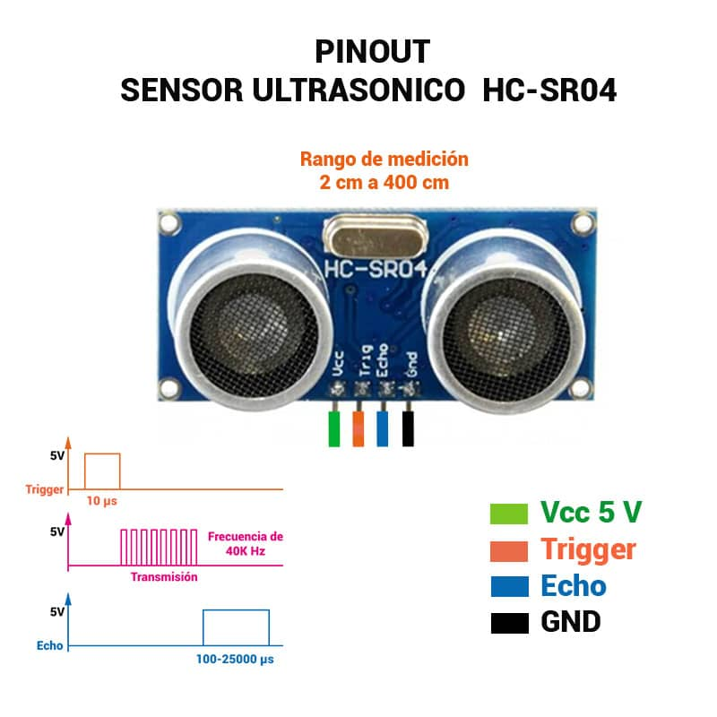
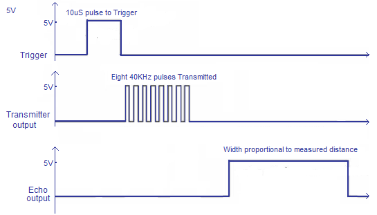

# HC-SR04-Ultrasonic-Distance-Sensor

## Descripción:
El sensor HC-SR04 esta compuesto por un
emisor y un receptor de ultrasonidos.
Estos nos ayuda a medir la distancia a la
que se encuentra un objeto justo frente a
el, enviando un pulso de ultrasonidos y
midiendo el tiempo que transcurre hasta
que vuelve dicho pulso.

## Pines del sensor:
- Vcc: Pin de alimentación. (5V)
- Trigger: Pin de disparo. Este pin es una entrada, por lo que en el sistema de control,
por ejemplo Arduino, se tiene que conectar a una salida.
- Echo: Este pin es una salida del sensor, por lo que ha de ser conectado a una
entrada del sistema de control.
Gnd: Pin negativo de alimentación.

## Características eléctricas:
- Voltaje de trabajo: 5V.
- Corriente de trabajo: 15mA.
- Frecuencia de trabajo: 40KHz
- Rango de funcionamiento: 2 a 500 cm
- Ángulo de detección: 15 a 20 grados.

## Funcionamiento y Diagrama de temporización:  
En el diagrama de temporización se aprecia como solo es necesario aplicar un pulso
de 10uS en el pin trigger para comenzar con la medición.  
A continuación el sensor envía una serie de 8 pulsos de 40KHz y pone el pin de Echo
a nivel alto.  
El pin Echo permanecerá a nivel alto hasta que se reciba el eco de los pulsos de
40KHz.  
Para saber a la distancia a la que se encuentra el objeto, solo hay que medir el
tiempo al que está el pin Echo a nivel alto y aplicar la siguiente formula.

